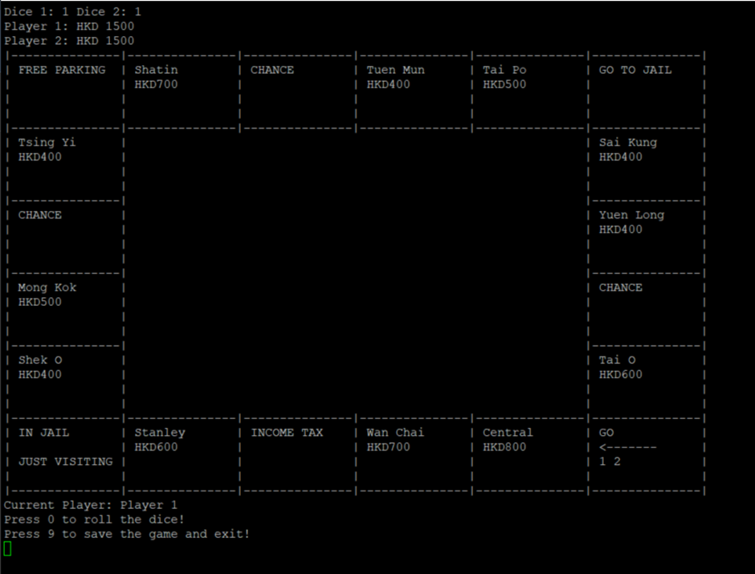
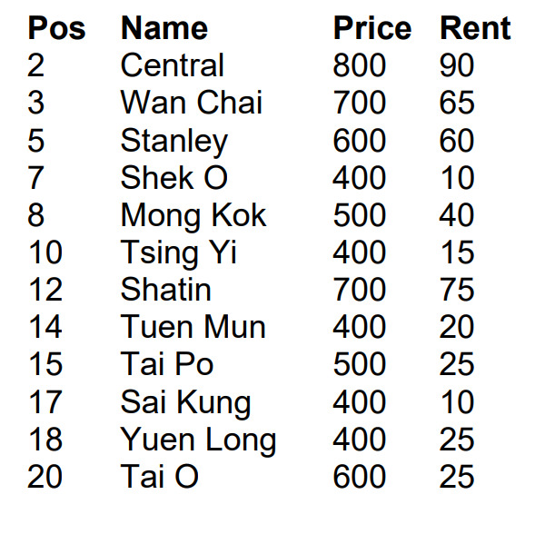
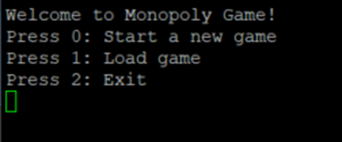
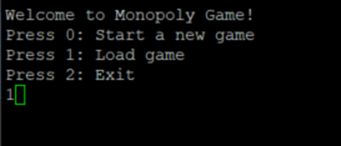
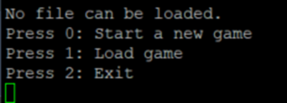
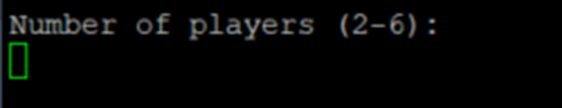
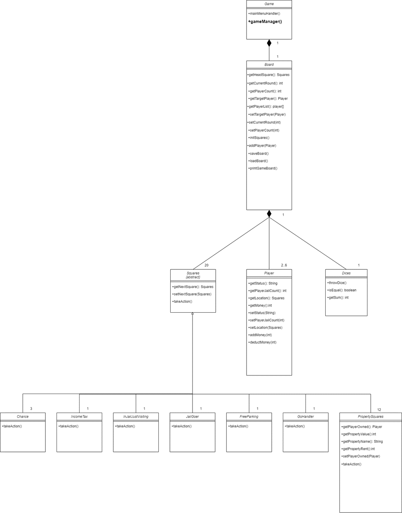
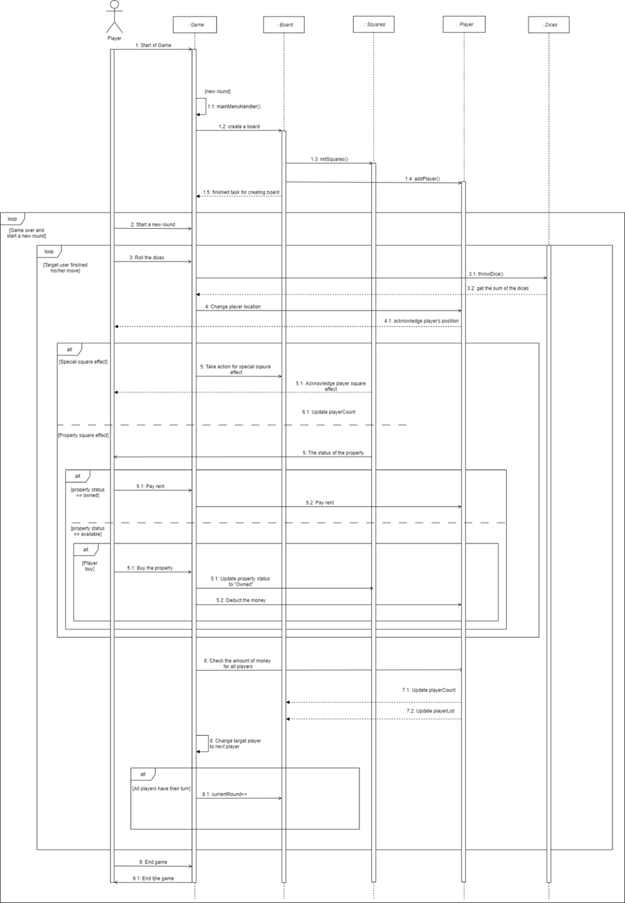

# Monopoly CLI Game

## Overview
The Monopoly CLI game is built on **Java JDK 1.8.0_261** and programmed on the **IntelliJ IDE**. 

The goal of this project is to replicate the Monopoly board game in command-line interface.

## Core Features
- Number of players: 2-6
- Game instance saving and loading with Jakarta Servlet module (.ser file)

## Game rules
- Players have money and can own
  properties. Each player starts with
  HKD 1500 and no property.
- All players start from the first
  square (“Go”).
- Players take turns in rolling the
  dice and advancing their
  respective tokens clockwise on the
  board. After reaching square 20, a
  token moves to square 1 again.
- Certain squares take effect on a
  player (see below) when her token
  passes or lands on the square. For
  example, they can change the
  player’s amount of money.
- If after taking a turn a player has a
  negative amount of money, she
  retires from the game. All her
  properties become unowned.
- A round consists of all players
   taking their turns once.
- The game ends either if there is only one player left or after 100 rounds. The winner is
  the player with the most money at the end of the game. Ties (multiple winners) are
  possible.

###The Game Board

####Property Values

#### Special Squares

- **Go**: Every time a player passes through (not necessarily lands on) this square, she gets HKD 1500 salary.
- **Chance**: If a player lands on one of these squares, she either gains a random amount (multiple of 10) up to HKD 200 or loses a  random amount (multiple of 10) up to HKD 300.
- **Income tax**: If a player lands on this square, she pays 10% of her money (rounded down to a multiple of 10) as tax.
- **Free parking**: This square has no effect.
- **Go to Jail**: If a player lands on this square, she  immediately goes to the “In Jail” part of the “In  Jail/Just Visiting” square.
- **In Jail/Just Visiting**: If a player lands on this  square, she is “Just Visiting”: the square has  no effect. However, if the player got here by  landing on “Go to Jail”, she is in jail and

## Setup

### Requirements
- You must install Java JDK 1.8.0_261 on your PC. Any version higher or lower than that might not work.

### Launching the game
1. Clone this repo
2. Execute "run.bat" in the root directory.

## Gameplay

###Step 1 
Run the Monopoly Game file by following the instructions above.

###Step 2 
Once the file is loaded, type “0” and press “Enter” to start a new game.  

If you previously stored a game on your computer and a save file "Board.ser" is in the repository, you can continue that game instance by pressing 1.

If the warning "No file can be loaded" is shown, it means the "Board.ser" save file is not found. You can either exit the game or start a new game.

Remark: If you choose to load a previous game, please skip step 3 and continue by step 4.  If you choose to start a new game, please continue to follow the steps below.

*: Only applicable to starting a new game

###Step 3*
 Please enter the number of players for this game and press “Enter” to continue.  Make sure the number you enter is between 2 and 6 as this Monopoly Game only allows 2 to 6 players.

###Step 4
Type “1” and press “Enter” to start the game.  If you want to discard and go back to step 2, please type “0” and press “Enter”.

###Step 5
- **If you start a new game**: The Monopoly board interface will be shown with all
participants landing on “Go” square
- **If you load the previous game**: The Monopoly board interface will be shown with 
the participants landing on the square they landed on previously.  The amount of money they had are the same as the one they had previously.

###Step 6
The game will start from the first player to the last player of the game and keep repeating for each round.  Once the player passes through the “Go” square, his/her amount of money will increase by HKD1500.

## Class Diagram

The rationale on this design is that the Game class is the "core part" of the system. The gameManager() function of the game class is to coordinate the workflow of the entire game.

Each other class is essentially an element in the Monopoly board. 

The Board class contains functions that keep tracks of the current status of the game; 

The player class represents the status of each player (current round, money);

The Dice class contains functions to return a random number for dice drawing; 

The Squares class and each of its subclasses contains its own specific functions that affects the gameplay.

## Sequence Diagram

